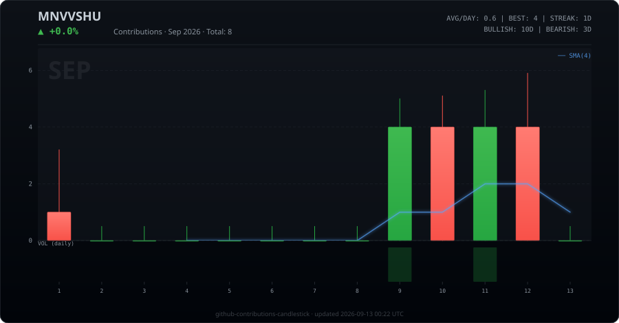

## ⚡ Lil Intro

Hey there! I'm **Manvesh** — a passionate developer who loves to push the boundaries of what's possible. Whether it's optimizing systems, building tools, or experimenting with new tech, I'm always down to ship something interesting.

> *"Code is poetry — write it like no one's watching, ship it like everyone is."*

---

## 🛠️ Languages I Got a Lil Grip At

<table>
<tr>
  <td align="center"> Bash</td>
  <td align="center"> HTML5</td>
  <td align="center"> CSS3</td>
  <td align="center"> JavaScript</td>
  <td align="center"> Python</td>
  <td align="center"> C#</td>
  <td align="center"> CoffeeScript</td>
  <td align="center"> Java</td>
  <td align="center"> Go</td>
  <td align="center"> PHP</td>
</tr>
</table>

---

## 📈 Contribution Graph

Each candle = 1 week · 🟢 Bullish (ended week stronger) · 🔴 Bearish (tapered off) · Blue line = 4-week SMA

  

---

  
*Thanks for stopping by — drop a ⭐ if anything here was useful!*

